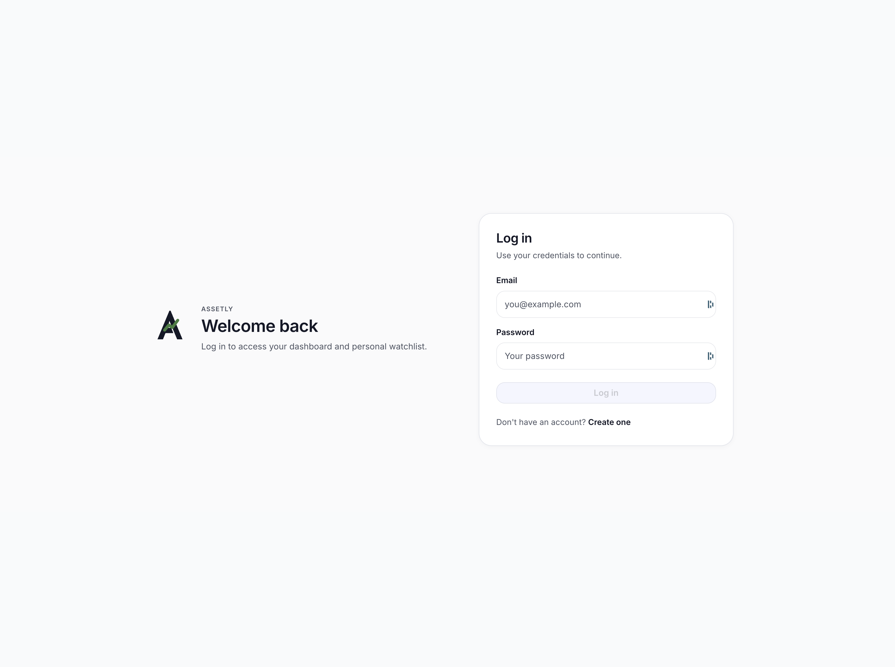
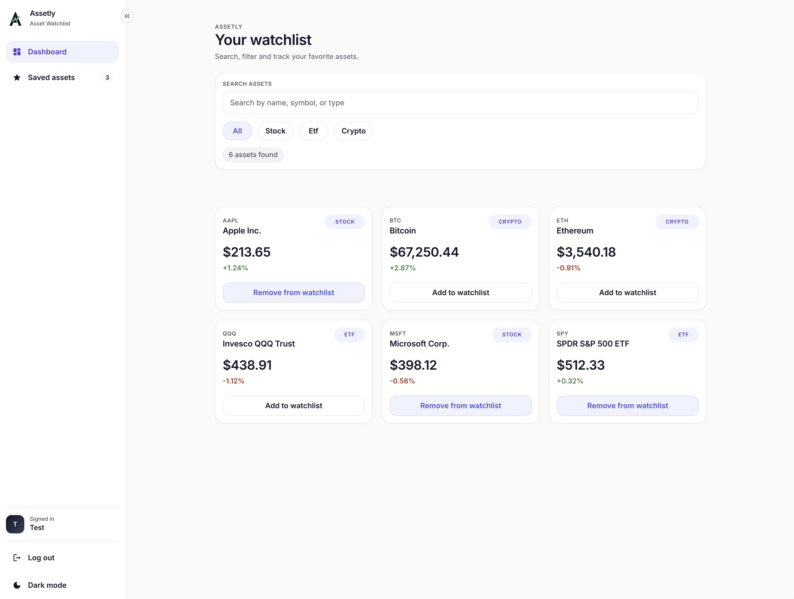
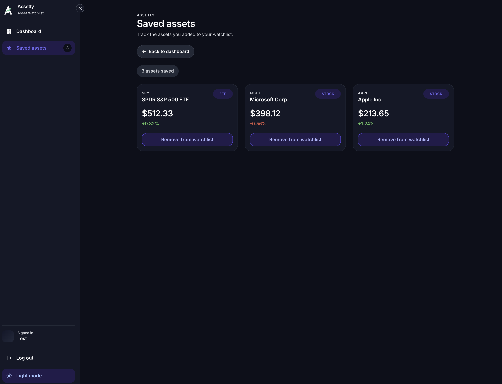

# Assetly

Assetly is a full-stack asset watchlist application built as a portfolio project from an initial technical exercise. It combines a React frontend with an Express API, persistent PostgreSQL storage, and authentication-protected user flows for saving and tracking assets.

## Why this project exists

This project was built to demonstrate a complete full-stack workflow, including
API design, authentication, database persistence, and real-world deployment
across multiple services.

## Overview

The application lets users create an account, sign in, browse available assets, and manage a personal watchlist. The frontend focuses on responsive UI, client-side routing, and async data handling, while the backend provides authentication, validation, and database persistence.

## Features

- User signup and login with JWT authentication
- Protected watchlist tied to the authenticated user
- Asset list with dedicated API-backed data fetching
- Add and remove assets from the watchlist
- Full-stack TypeScript architecture
- Deployment-ready frontend and backend configuration

## Tech Stack

### Frontend

- React
- Vite
- TypeScript
- TanStack Query
- React Router
- Material UI (MUI)

### Backend

- Express
- TypeScript
- Prisma
- PostgreSQL
- JWT authentication
- Zod validation

### Deployment

- Frontend: Vercel
- Backend: Render
- Database: Supabase Postgres

The application is fully deployed and accessible via the links below.
The frontend communicates with the backend through a configured environment variable (VITE_API_URL).

## Architecture

```text
client/
├── public/
├── src/
│   ├── app/
│   ├── components/
│   ├── config/
│   ├── features/
│   ├── layouts/
│   ├── lib/
│   ├── pages/
│   └── theme/

server/
├── prisma/
│   ├── schema.prisma
│   └── seed.ts
├── src/
│   ├── lib/
│   ├── middleware/
│   ├── routes/
│   ├── schemas/
│   ├── services/
│   ├── types/
│   ├── app.ts
│   └── server.ts
```

The frontend communicates with the backend via REST APIs.
The backend handles authentication, validation, and database access using Prisma.
The database is hosted on Supabase and accessed through a connection pooler in production.

## Local Setup

### 1. Clone the repository

```bash
git clone <REPOSITORY_URL>
cd <PROJECT_DIRECTORY>
```

### 2. Install dependencies

```bash
cd client && npm install
cd ../server && npm install
```

### 3. Configure environment variables

```bash
cp client/.env.example client/.env
cp server/.env.example server/.env
```

### 4. Prepare the database

From `server/`:

```bash
npx prisma migrate dev
npx prisma db seed
```

### 5. Run the application

Backend:

```bash
cd server
npm run dev
```

Frontend:

```bash
cd client
npm run dev
```

## Environment Variables

### Frontend

`client/.env`

```env
VITE_API_URL=
```

### Backend

`server/.env`

```env
DATABASE_URL=
DIRECT_URL=
JWT_SECRET=
PORT=
CORS_ORIGIN=
```

## Deployment Links

- Frontend (Vercel): <https://assetly-swart.vercel.app/>
- Backend (Render): <https://assetly-3hdd.onrender.com>
- Database: Supabase (PostgreSQL)

## Screenshots

### Signup / Login



### Dashboard



### Watchlist



## Key Learnings

- Managing environment variables across multiple deployment platforms
- Handling CORS and cross-origin communication between frontend and backend
- Configuring Prisma with Supabase and connection pooling
- Debugging real-world deployment issues (CORS, networking, migrations)

## Future Improvements

- Add automated tests for frontend and backend
- Improve filtering, sorting, and search UX
- Add richer asset metadata and detail views
- Introduce refresh tokens or more advanced session handling
- Add CI for linting, type-checking, and deployment checks
- Expand the product into broader portfolio tracking features
